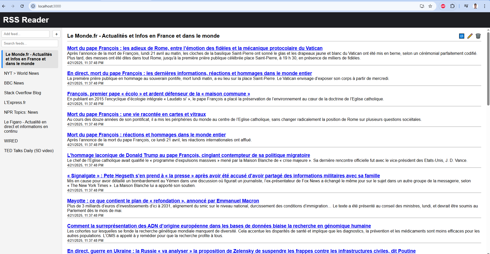

# 📰 Full-Stack RSS Reader App (React + Django)

This project is a full-stack RSS Reader built with **React** (frontend) and **Django REST Framework** (backend). It allows users to add RSS feed URLs, view articles, refresh feeds, and manage them through a clean UI.



---

## 🚀 Features

- Add RSS feed URLs
- Parse and store articles using `feedparser`
- View articles by feed
- Refresh feeds manually
- Search/filter feeds
- Simple REST API
- Docker & Docker Compose support
- Ready for CI/CD and deployment

---

## 🧱 Tech Stack

| Layer      | Tech                       |
|------------|----------------------------|
| Frontend   | React, Axios, CSS          |
| Backend    | Django, DRF, Feedparser    |
| Dev Tools  | Docker, Docker Compose     |
| Database   | SQLite (default)           |

---

## 📁 Project Structure

```
project-root/
├── backend/        # Django backend
├── frontend/       # React frontend
├── docker-compose.yml
└── README.md
```

---

## ⚙️ Local Development

### ▶️ Backend (Django)

```bash
cd backend
python -m venv .venv
.venv\Scripts\activate  # or source .venv/bin/activate
pip install -r requirements.txt
python manage.py migrate
python manage.py runserver
```

Runs at: http://localhost:8000

---

### ▶️ Frontend (React)

```bash
cd frontend
npm install
npm start
```

Runs at: http://localhost:3000

---

## 🐳 Docker Setup

### docker-compose.yml

```yaml
version: '3.9'

services:
  backend:
    build:
      context: ./backend
    container_name: django-backend
    command: python manage.py runserver 0.0.0.0:8000
    volumes:
      - ./backend:/app
    ports:
      - "8000:8000"
    env_file:
      - ./backend/.env

  frontend:
    build:
      context: ./frontend
    container_name: react-frontend
    volumes:
      - ./frontend:/app
      - /app/node_modules
    ports:
      - "3000:3000"
    stdin_open: true
    tty: true
```

### Build & Run

```bash
docker-compose up --build
```

---

## 🔁 API Endpoints

| Method | Endpoint                   | Description                       |
|--------|----------------------------|-----------------------------------|
| GET    | `/api/feeds/`              | List all feeds                    |
| POST   | `/api/feeds/`              | Add a new feed (JSON: `{url}`)    |
| POST   | `/api/feeds/{id}/refresh/` | Refresh a feed manually           |
| GET    | `/api/items/?feed={id}`    | Get items for a specific feed     |
| DELETE | `/api/feeds/{id}/`         | Delete a feed                     |

---

## 📄 Environment

- Frontend calls backend via `http://localhost:8000/api/`
- CORS enabled in Django for development
- SQLite used by default (easy dev setup)

---

## 📄 License

MIT – feel free to use, fork, and contribute.
